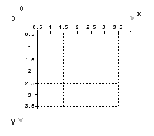

# 1.1 영상 처리의 개요

## 1.1.1 디지털 영상 처리란?
영상 처리(image processing)란 영상을 대상으로 하는 신호 처리(signal processing)의 한 분야로써 영상으로부터 원하는 정보를 얻기 위해 행하는 모든 종류의 처리를 의미한다.

## 1.1.2 다양한 영상 처리 응용 분야

* 얼굴 검출과 얼굴 인식
* 내용 기반 영상 검색
* 컬러 영상의 화질 개선
* 의료 영상 분야
* 문서 처리
* 공장 자동화
* 인공지능 로봇과 자율 주행 자동차

# 1.2 영상 처리 프로그래밍
2차원 배열의 동적 할당과 해제에 대한 C/C++ 문법 숙지 필요

## 1.2.1 영상 표현 방법
**그레이스케일(grayscale) : 색상 정보 없이 오직 밝기 정보만으로 구성된 영상을 의미. 영상 처리에서 주로 사용하는 영상**

**트루컬러(true-color) :**

영상의 기본 단위를 픽셀(pixel), 픽셀은 picture element 의 줄임말이며, 국내에서는 화소로 번역

그레이스케일 영상에서 하나의 픽셀은 0부터 255사이의 정숫값을 가진다.
이는 하나의 픽셀을 표현하기 위하여 컴퓨터에서 1byte 의 메모리 공간을 사용하기 때문이다. 

픽셀 값이 0 이면 검은색, 255면 흰색이다.

1byte = 8bit

0000 0000 (128 64 32 16 8 4 2 1)



https://kr.mathworks.com/help/images/image-coordinate-systems.html

컴퓨터에서 영상을 표현하기에는 이처럼 y좌표가 아래쪽 방향으로 증가하는 체계가 더 적합하다.            

## 1.2.2 2차원 배열 처리
```c++
unsigned char a[480][640]; // 가로 640, 세로 480 인 그레이스 케일 영상 
// unsigned char 는 0~255 범위 가짐 (8bit = 1byte)
```
실제 영상 처리 프로그래밍에서는 정적 배열 대신 프로그램 동작 시 배열의 크기를 결정하는 동적 배열(dynamic array) 을 주로 사용한다.

```c++
unsigned char** p;
p = new unsigned char*[h];
for(int i=0; i<h; i++)
{
    p[i] = new unsigned char[w];
}
//2차원 동적 배열은 이중 포인터를 이용하여 생성한다. 가로 w, 세로 h 인 영상을 표현하는 2차원 배열을 동적 생성하는 방법

//메모리 공간 해제
for(int i=0; i<h; i++)
    delete[] p[i];
delete[] p;
```


# 1.2.3 변형된 2차원 배열 동적 할당
```c++
#include<memory.h>

unsigned char **p;
p = new unsigned char*[h];
p[0] = new unsigned char[w*h];
for(int i=01; i<h; i++)
    p[i] = p[i-1] + w;
memset(p[0], 0, w*h);
// unsigned char* 타입의 메모리 공간을 h 크기만큼 동적 할당하여 p에 저장.
// 이 중 맨 첫 번째 p[0] 은 영상 크기 전체 (w*h) 에 해당하는 메모리 공간을 할당하여 그 주소를 받게 하겼다.
// 나머지 p[1] 부터 p[h-1] 까지는 실질적인 new 연산자에 의한 동적 할당을 하지는 않고, 다만 p[0] 이 가리키고 있는 영상 전체 메모리 영역의 특정 주소를 가리키도록 설정

//메모리 공간 해제
delete[] p[0];
delete[] p;
```