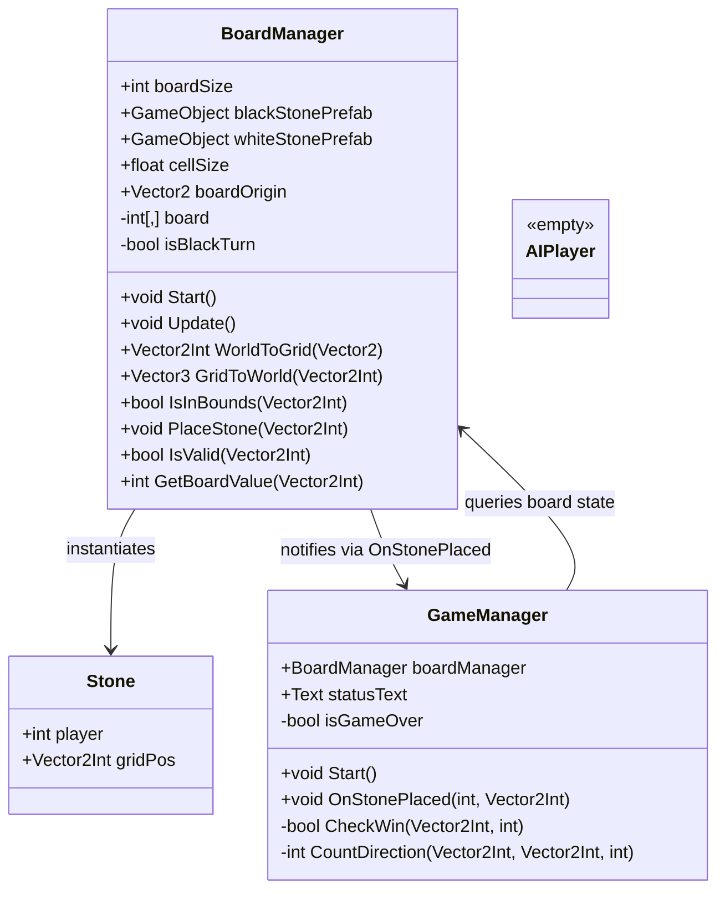
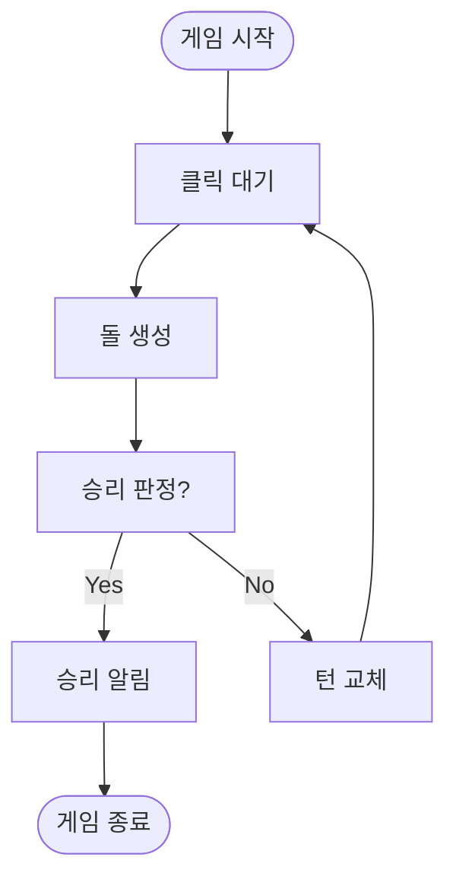

---

## 🎯 프로젝트 소개

저는 앞으로 언리얼 엔진으로 고성능 게임 개발에 도전할 계획입니다.  
그 첫걸음으로 비교적 간단한 **오목 게임**을 Unity로 만들어 보며 게임 개발 워크플로우를 익히고자 합니다.

---

## 🎮 왜 Unity인가?

- **간단함:** 언리얼 엔진보다 진입 장벽이 낮아 초보자가 빠르게 시작하기에 적합  
- **빠른 프로토타이핑:** 오목 같은 2D 게임을 구현하기에 충분한 기능 제공  

---

## 🛠️ 개발 환경 세팅

### 1️⃣ Unity 설치

1. Unity Hub 다운로드 → [Unity 다운로드](https://unity.com/download)  
2. Unity Hub 실행 → **Installs → Add version → Unity 2023.3 LTS** 선택  
3. Windows/macOS Build Support 체크 후 설치  

### 2️⃣ Rider 설치

- JetBrains Rider 다운로드 → [Rider 다운로드](https://www.jetbrains.com/rider/)
- C# 코드 작성과 Unity 통합 지원이 우수하여 선택  

---

## 🎮 기능 정의 (Scope)

1. **보드 그리기** (15×15 그리드)  
2. **돌 놓기** (클릭 시 돌 생성)  
3. **승리 판정** (가로·세로·대각선 5연속 체크)  

---

## 📊 다이어그램

### 클래스 다이어그램

### 플로우차트

