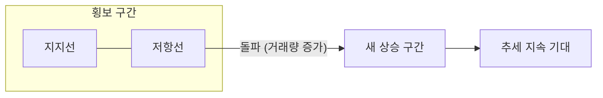
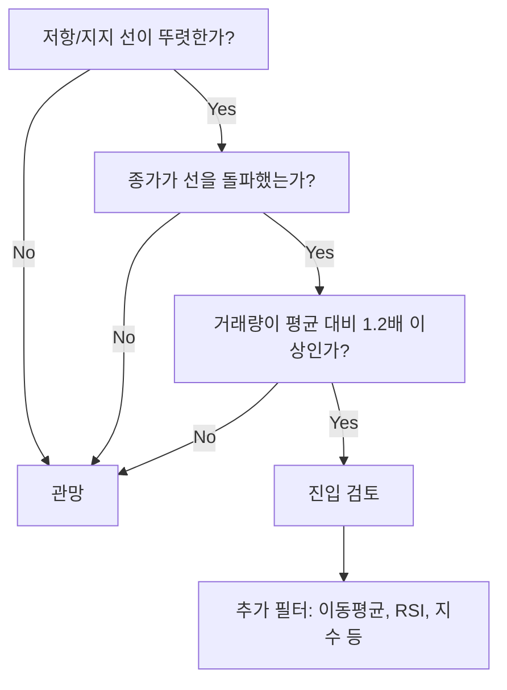
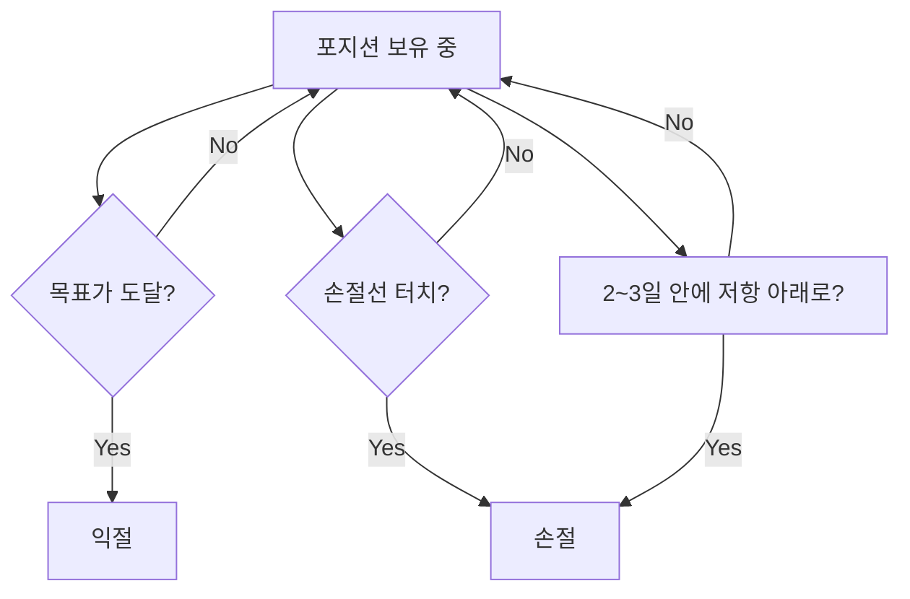
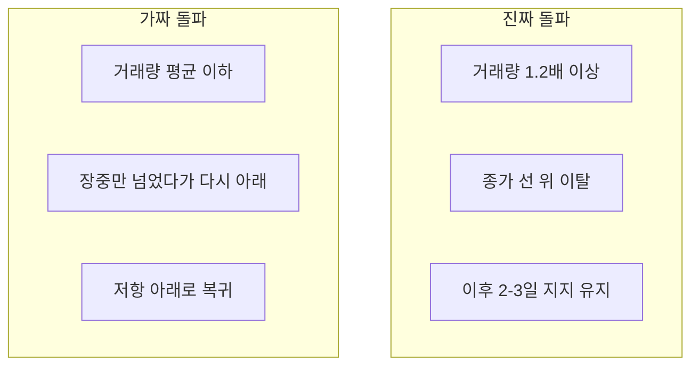

# 돌파 전략(Breakout) 실전 정리 - 이론부터 진입·청산까지

주가가 일정 기간 형성된 가격 범위(저항선 또는 지지선)를 거래량과 함께 돌파할 때, 새로운 추세가 시작된다고 보고 진입하는 전략이 **돌파 전략**입니다. 이 글에서는 개념부터 진입·청산 원칙까지 정리합니다.

---

## 1. 돌파 전략이란?

**돌파 전략(Breakout Strategy)**은 주가가 **저항선** 또는 **지지선**을 **거래량과 함께** 돌파할 때, 새로운 추세가 시작된다고 보고 진입하는 기술적 분석 기반 매매 전략입니다.

먼저 핵심 개념을 정리합니다.

- **저항선**: 주가가 몇 번이고 올라갔다가 막히던 가격대 (천장처럼 느껴지는 구간)
- **지지선**: 주가가 떨어졌다가 받쳐 주던 가격대 (바닥처럼 느껴지는 구간)
- **돌파**: 그 선을 위나 아래로 뚫고 나가는 순간
- **거래량 확인**: 돌파할 때 거래량이 평소보다 많아야 "진짜 돌파"로 보자는 관점

저항선 돌파 시에는 매수 진입, 지지선 이탈 시에는 매도(공매도) 진입을 고려합니다. 실전에서는 **종가** 기준으로 돌파 여부를 확인하는 경우가 많고, 거래량이 평균 대비 20% 이상 증가한 돌파를 더 신뢰합니다.

### 차트에서 보면 (개념)

가격이 구간 안에서 왔다 갔다 하다가, 어느 순간 저항을 뚫고 올라가는 흐름은 다음과 같습니다.

즉, **횡보 → 저항 테스트 → 돌파 → 상승 구간**으로 넘어갈 때 매수 진입을 노립니다.

---

## 2. 왜 쓰는가?

돌파를 "선 하나 넘은 것"으로만 보기보다는, **그 가격대를 시장이 어떻게 보고 있는지**가 중요합니다.

- **저항선 돌파**: 그 가격대의 매도 압력이 어느 정도 소진되고 매수 세력이 강해졌다는 의미로 해석
- **지지선 이탈**: 그 가격대의 매수 의지가 약해지고 매도 압력이 강해졌다는 의미로 해석
- **거래량 증가**: 많은 참여자가 돌파를 인지하고 동참했다는 신호로 해석

실전에서 기대하는 것은 크게 세 가지입니다. 첫째, 한 번 제대로 돌파되면 추세가 잠깐은 이어지는 경우가 많다는 **모멘텀**. 둘째, 많은 트레이더가 같은 가격대를 지지·저항으로 보기 때문에 그 구간이 실제로 의미 있는 레벨로 작동한다는 점. 셋째, “이 선을 넘기 전에는 관망, 넘으면 진입, 다시 아래로 깨지면 손절”처럼 규칙을 정하기가 쉬운 것입니다.

차트 패턴(삼각형, 사각형 등)의 돌파 해석과도 맞닿아 있어, 기술적 분석을 쓰는 트레이더에게 익숙한 프레임입니다.

---

## 3. 진입·청산 원칙

연구와 실무에서 자주 쓰이는 기준만 원칙 수준으로 정리합니다. 수치는 참고용이며, 자신의 리스크 성향과 백테스트 결과에 맞게 조정하는 것이 좋습니다.

### 진입 원칙

**필수로 보는 것**

1. **저항/지지 확인**  
   최근 20~60일 고점(저항) 또는 저점(지지)을 쓰는 경우가 많습니다. 최소 2회 이상 테스트된 가격대를 우선합니다.

2. **돌파 확인**  
   **종가**가 저항선을 상향 돌파(또는 지지선을 하향 이탈)한 것을 확인한 뒤 진입합니다.  
   - 약한 돌파: 저항선 대비 0.5% 내외  
   - 강한 돌파: 1% 이상 이탈 시 신뢰도를 더 높게 보는 경우가 많음  

3. **거래량 확인**  
   돌파일 거래량이 최근 20일 평균 대비 최소 1.2배(20% 증가), 이상적으로는 1.5~2배(50~100% 증가)를 많이 사용합니다. 거래량이 평균 이하인 돌파는 가짜 돌파일 가능성을 더 의심합니다.

**선택적으로 보는 것**: 이동평균선(20일·50일) 위에서의 돌파, RSI 50 이상·MACD 골든크로스 등 모멘텀 지표, 시장 지수(코스피·코스닥) 추세와의 정합성.

진입 여부를 판단할 때의 흐름은 다음과 같습니다.

### 청산 원칙

**익절**

- **목표가**: 돌파 가격에서 3~5% 올랐을 때(보수적), 7~10% 올랐을 때(적극적)처럼 두는 방식이 많습니다. ATR(평균 진폭)을 쓰면 "진입가 + ATR×2"처럼 변동성에 맞춰 목표를 잡을 수 있습니다.
- **기술적 익절**: RSI 과매수(예: 70 이상), 볼린저 상단 터치, MACD 데드크로스 등으로 일부 또는 전량 청산할 수 있습니다.
- **시간**: 최대 보유 기간(예: 10일)을 정해 두고, 그 전에 목표나 손절에 걸리지 않으면 시간으로 끊는 것도 방법이 있습니다.

**손절**

- **고정 손절**: 진입가 대비 -2%~-3%(보수적), -5%(공격적) 등 비율로 끊는 게 가장 단순합니다.
- **구조적 손절**: 돌파했던 저항선이 지지로 작동하다가, 그 지지선을 종가 기준으로 이탈하면 손절하는 방식입니다.
- **가짜 돌파 인정**: 돌파 후 2~3일 안에 다시 저항선 아래로 들어가면 “가짜 돌파”로 보고 손절하는 게 원칙입니다.

목표가 도달했을 때 일부만 청산하고, 나머지는 이동 손절로 추적하는 방식도 많이 씁니다. 돌파 레벨이 지지/저항으로 전환되면, 손절선을 그 레벨 쪽으로 당겨서 이익을 보호할 수 있습니다.

청산 판단 흐름은 다음과 같습니다.

---

## 4. 실전 시 유의점

### 가짜 돌파(False Breakout)

돌파 직후 다시 저항선(또는 지지선) 안으로 들어가는 경우가 많습니다. 이를 **가짜 돌파(False Breakout)**라고 부릅니다.

- **대응**: 거래량 기준을 강화하고(예: 평균 1.5배 이상), “돌파 당일 즉시 진입” 대신 돌파 후 2~3일 지지 확인을 본 뒤 진입하는 **리테스트 전략**을 병행할 수 있습니다.  
- 돌파 직후 수 초~수 분 안에 판단해야 하는 상황은 오판 가능성이 크므로, 조건부 주문(스탑)과 알림을 함께 쓰는 것이 좋습니다.

진짜 돌파와 가짜 돌파를 구분할 때 참고할 수 있는 흐름은 다음과 같습니다.

### 과도한 거래와 수수료

작은 움직임마다 돌파로 보면 거래 횟수와 수수료가 늘어납니다.  
- **대응**: “최소 N일 고점/저점”, “거래량 N배 이상”, “돌파 폭 N% 이상”처럼 진입 조건을 정해 두고 필터를 강화합니다.

### 시장 상황

하락장이나 횡보장에서는 돌파 후에도 추세가 금방 꺾이는 경우가 많습니다.  
- **대응**: 코스피·코스닥 같은 지수 추세를 보고, 하락 추세가 뚜렷할 때는 돌파 매수 진입을 줄이거나 멈추는 식으로 조절하면 됩니다.

### 심리

손절을 미루거나, FOMO(놓칠까 봐 조급해지는 마음)에 끌려 조건에 안 맞는 돌파에도 들어가기 쉽습니다.  
- **대응**: 진입·손절·익절·최대 보유 기간을 규칙으로 적어 두고, 한 번 정한 규칙을 지키는 습관이 중요합니다. 자동매매나 알림을 쓰면 감정이 덜 개입됩니다.

---

## 5. 참고 및 다음 단계

- 이 블로그 **[초단기 매매 5종 전략 총정리](/categories/stock/)**에서 돌파·갭·모멘텀·볼륨·VWAP을 같이 비교해 볼 수 있습니다.
- **주식 전략 심층 조사 계획**([체계적인 자료 수집과 방법론](/2025/12/20/stock-strategy-research-plan.html))에서 돌파를 포함한 전략별 자료 수집·백테스팅·실전 검증 흐름을 정리해 두었습니다.
- 돌파 전략을 쓸 때는 **자기 자본·리스크 성향에 맞게** 목표가·손절·포지션 크기를 정하고, 가능하면 과거 데이터로 백테스트한 뒤 실전에 적용하는 것을 권합니다.

한국 시장은 외국인·기관 매매와 거래량 구조가 중요하므로, 돌파일의 거래량과 수급을 같이 보는 습관이 도움이 됩니다.
